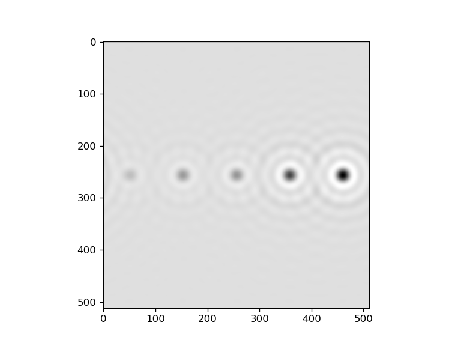
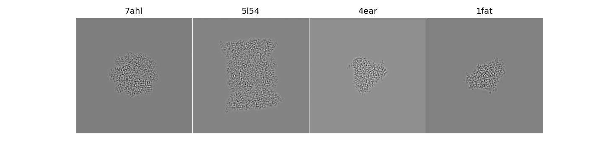

# emsim

A Python3 library for multi-slice TEM imaging simulation.

## Install

This package contains a basic numpy implementation of multi-slice algorithm, and two extensions based on fftw and cuda, respectively.
The extensions are optional if you only want to use the numpy implementation.

To install, first clone this repository.

```bash
$ git clone git@github.com:Varato/emsim.git
$ cd emsim
```

For minimal installation (only numpy code), do

```bash
$ python setup.py install
```

To build with fftw and/or cuda extensions, make sure you at least have fftw installed correctly and your compiler knows the location
of `libfftw3f`. For Windows users, `emsim` ships with `libfftw3f-3.lib` (called import library on Windows) and `libfftw3f-3.dll` (the real dynamic library), and the header `fftw3.h` is also shipped at `emsim/backend/fftw_ext/include/`. So no further install of fftw is required. `emsim` uses cmake's `CUDAToolkit_FOUND` to determine wheter to install the cuda extensions, which requires cmake version >= 3.17. So make sure cuda toolkit is installed correctly on your OS and cmake version is satisfied if you want to use cuda extensions. In addition, `pybind11` is added as a git submodule, run the following to pull `pybind11`.

```bash
$ git submodule init
$ git submodule update
```

There are more things for Windows users. Windows prefers Visual Studio as its build system. So make sure you have Visual Studio installed and its version is compatible with your cuda toolkit (I compiled successfully with VS 2019 and CUDA 10.1). Internally, the `setup_with_exts.py` calls cmake to build the c++ and/or cuda code, and the target build system is set to `Ninja` if the system is Windows (which is shipped with Visual Studio). So make sure you have Ninja installed and in PATH.
Then run the following within the `x64 Native Tools Command Prompt for VS 2019`.

```bash
$ python setup_with_exts.py install
```

For *nix users, directly running the above command should work.

Of course, you can directly use cmake to build the extensions with full freedom of choosing build tools. For example, on Windows, NMake (shipped with Visutal Studio) can be used.

1. open `x64 Native Tools Command Prompt for VS 2019`
2. go to the to emsim's root folder
3. `mkdir build; cd build`
4. `cmake -S.. -B. -G"NMake Makefiles"`
5. `nmake`

## Usage

### Example 1: five atoms

The following code uses low level APIs, where one sets atoms locations himself and propagate electron waves step by step using an `emsim.wave.WavePropagator` instance.
The full code is in `demos/five_atoms.py`. The example is from Kirkland 2010, P.95.

```Python
import emsim


tem = emsim.tem.TEM(
    electron_dose=20,
    beam_energy_kev=200,
    cs_mm=1.3,
    defocus=700,
    aperture=10.37e-3
)

# use Scherzer's imaging condition
tem.set_scherzer_condition()

# The example from Kirkland 2010, P.95
# Five atoms, C, Si, Cu, Au, U, are placed on the z=0 plane, with coordinates (z=0, x, y) in unit of Angstroms.
mol = emsim.atoms.AtomList(
    elements=np.array([6, 14, 29, 79, 92], dtype=np.int), 
    coordinates=np.array([[0,0,5], [0,0,15], [0,0,25],[0,0,35], [0,0,45]], dtype=np.float32))
mol = emsim.atoms.centralize(mol)

# set backend. Choices are numpy, fftw, cuda
emsim.config.set_backend('numpy')
image_shape_ = (512, 512)
pixel_size_ = 50/512

propagator = tem.get_wave_propagator(wave_shape=image_shape_, pixel_size=pixel_size_)
aslice = emsim.pot.build_one_slice(mol, pixel_size=pixel_size_, lateral_size=image_shape_)

wave = propagator.init_wave()                  
exit_wave = propagator.slice_transmit(wave, aslice)
image_wave = propagator.lens_propagate(exit_wave)

image = emsim.utils.array.assure_numpy(abs(image_wave)**2)
```



## Example 2: proteins

The following code uses high-lvel APIS, where the molecules are specified by PDB codes.

```Python
import emsim


emsim.config.set_backend("cuda")

class Molecules(object):
    def __init__(self):
        self.pdbs = ["7ahl", "5l54", "4ear", "1fat"]

    def __iter__(self):
        pdb_data_dir = emsim.io.data_dir.get_pdb_data_dir_from_config()
        for pdb_code in self.pdbs:
            pdb_file = emsim.utils.pdb.retrieve_pdb_file(pdb_code, pdb_data_dir)
            mol = emsim.utils.pdb.build_biological_unit(pdb_file)
            mol.label = pdb_code
            # get an orientation for each molecule
            quat = np.array([1., 0., 0., 0.]) # emsim.utils.rot.random_uniform_quaternions(1)
            yield emsim.atoms.rotate(mol, quat, set_center=True)


class ResultHandler:
    def __init__(self):
        self.images = []

    def __call__(self, result, label):
        print(f"got image for label = {label}")
        self.images.append(result)


microscope = emsim.tem.TEM(
    electron_dose=20,
    beam_energy_kev=200,
    cs_mm=1.3,
    defocus=700,
    aperture=10e-3
)

image_pipe = emsim.pipe.Pipe(
    microscope=microscope,
    resolution=2,
    slice_thickness=2,
    roi=256,
    add_water=False,
)


result_handler = ResultHandler()
mols = Molecules()
sim = emsim.simulator.EMSim(image_pipe, mols, result_handler)
sim.run()
```



In this example, the `emsim.tem.TEM` instance specifies optical parameters, electron dose and beam energy. The `emsim.pipe.Pipe` instalce further specifies the imaging conditions including image size (`roi`), `slice_thickness` (in Angstroms. It affects accuracy of the multi-slice algorithm), `resolution` (double of pixel size in Angstroms) and whether the proteins are embedded within amorphous ice (`add_water`). The `emsim.simulator.EMSim` also takes a user defined callable `result_handler`, where one can define how the resulted images are dealt with. In this example the images are simply stored in memory.


## TODOs

- [ ] Add partially coherent CTF
- [ ] Add electron absorption
- [ ] Test crystalline samples
- [ ] Add dark-field imaging